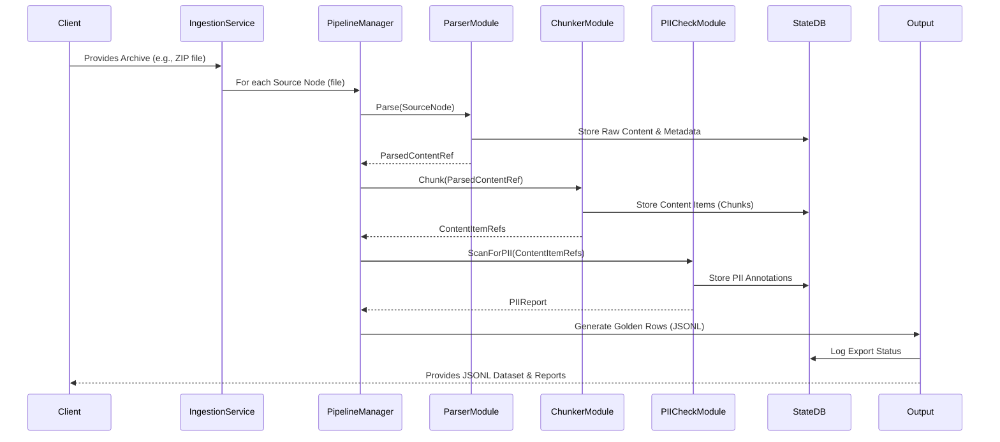

# M0: Architecture & Workflow - Dataset Distiller

## 1. High-Level Architecture

The Dataset Distiller will adopt a modular, service-oriented architecture. The core components are:

1.  **Ingestion Service:** Responsible for connecting to various data sources (local file system, Notion, GDrive, etc.), fetching raw data, and passing it to the pipeline.
2.  **Processing Pipeline (Core Engine):** A series of configurable modules that perform tasks like file type detection, parsing, text extraction, PII detection/redaction, chunking, metadata extraction, and validation. This will be orchestrated by a pipeline manager (potentially LangGraph or a custom solution).
3.  **State Database (StateDB):** A PostgreSQL database storing:
    *   Metadata about source files (name, type, source, checksum).
    *   Processed content (or pointers to it if stored on disk).
    *   Chunked content items with their relationships.
    *   PII locations and redaction status.
    *   Pipeline configurations.
    *   Job status and logs for each pipeline run.
4.  **API Layer (FastAPI):** Exposes endpoints for:
    *   Managing data sources and ingestion (M2).
    *   Defining and managing pipeline configurations (M2).
    *   Initiating and monitoring pipeline runs (CLI in M1, UI in M2).
    *   Retrieving processed data and reports (CLI in M1, UI in M2).
5.  **CLI:** Command-line interface for M1, allowing users to execute pipelines, specify configurations, and view basic status.
6.  **Web UI (M2):** A simple frontend for interacting with the API layer, providing a more user-friendly experience for managing the system.

```mermaid
graph TD
    subgraph User Interfaces
        CLI[CLI (M1)]
        WebUI[Web UI (M2)]
    end

    subgraph Data Sources
        LocalFS[Local Files/Folders]
        NotionAPI[Notion API]
        GDriveAPI[Google Drive API (M2)]
        ConfluenceAPI[Confluence API (Future)]
        OtherSources[Other Sources (Future)]
    end

    subgraph Dataset Distiller System
        API[API Layer (FastAPI)]
        IngestionService[Ingestion Service]
        PipelineManager[Pipeline Manager (LangGraph/Custom)]
        StateDB[State Database (PostgreSQL)]

        subgraph Processing Modules
            FileDetect[File Type Detection]
            Parser[Document Parsing (unstructured.io)]
            TextExtract[Text Extraction]
            Chunker[Chunking Engine]
            PIIDetect[PII Detection (Presidio)]
            PIIRedact[PII Redaction]
            MetaExtract[Metadata Extraction]
            Validator[Validation Engine]
        end

        OutputFormatter[Output Formatter (JSONL)]
    end

    CLI --> API
    WebUI --> API
    API --> IngestionService
    API --> PipelineManager
    API --> StateDB

    IngestionService --> LocalFS
    IngestionService --> NotionAPI
    IngestionService --> GDriveAPI
    IngestionService --> ConfluenceAPI
    IngestionService --> OtherSources

    IngestionService --> PipelineManager
    PipelineManager --> FileDetect
    PipelineManager --> Parser
    Parser --> TextExtract
    TextExtract --> Chunker
    Chunker --> MetaExtract
    Chunker --> PIIDetect
    PIIDetect --> PIIRedact
    PIIRedact --> Validator
    Validator --> OutputFormatter

    FileDetect --> StateDB
    Parser --> StateDB
    TextExtract --> StateDB
    Chunker --> StateDB
    MetaExtract --> StateDB
    PIIDetect --> StateDB
    PIIRedact --> StateDB
    Validator --> StateDB
    OutputFormatter --> StateDB
    PipelineManager --> StateDB


    OutputFormatter --> ExportedJSONL[Exported JSONL Files]
```

## 2. Core Data Workflow (Simplified)

This diagram illustrates the journey of a single "Source Node" (e.g., a file) through the pipeline.



**Workflow Steps:**

1.  **Initiation:** User initiates a pipeline run via CLI (M1) or UI (M2), specifying the input Archive and pipeline configuration.
2.  **Ingestion:**
    *   The Ingestion Service reads Source Nodes from the Archive.
    *   For each Source Node, basic metadata (filename, path, type if discernible) is recorded in StateDB.
    *   A job is created in StateDB to track the overall pipeline run.
3.  **Processing Loop (for each Source Node):**
    *   **File Type Detection:** Determine the actual file type (e.g., PDF, DOCX, TXT) using magic numbers or extensions. Update StateDB.
    *   **Parsing:** Based on file type, select the appropriate parser (e.g., `unstructured.io` for DOCX/PDF, custom for TXT/MD).
        *   Extracted raw content is stored (either directly in StateDB for small files or on a file system with a pointer in StateDB for large files).
        *   Parsing errors are logged in StateDB. "Fail-loud" - if a file cannot be parsed, it's marked as an error, and processing for that file may halt or be skipped based on config.
    *   **Chunking:** The raw content is divided into Content Items (chunks) using a configured strategy (e.g., by size, sentence, custom separator).
        *   Each Content Item is stored in StateDB, linked to its parent Source Node.
        *   Metadata (e.g., chunk number, position within source) is recorded.
    *   **PII Handling:**
        *   Each Content Item is scanned for PII using Presidio.
        *   Detected PII (type, location, confidence) is stored in StateDB, linked to the Content Item.
        *   Based on configuration, PII is redacted (e.g., replaced with placeholders like `[EMAIL]`) or only tagged. The modified Content Item is updated in StateDB.
    *   **Metadata Enrichment (Optional):** Additional metadata (e.g., summaries, keywords from LLM calls - future) can be added.
    *   **Validation:** Each Content Item (now potentially a "Golden Row" candidate) is validated against configured rules (e.g., max length, presence of required fields if applicable). Validation status is logged.
4.  **Export:**
    *   Successfully processed and validated Content Items ("Golden Rows") are formatted into JSONL.
    *   The JSONL output is written to the specified output location.
    *   A final report is generated (counts of processed files, errors, PII found, etc.).
5.  **Completion:** The pipeline run is marked as complete in StateDB.

## 3. State Management

*   **StateDB (PostgreSQL)** is central to the workflow. It ensures:
    *   **Resumability:** If a pipeline run is interrupted, it can be resumed from the last successfully completed step for each Source Node. This requires operations to be idempotent.
    *   **Traceability:** All metadata, PII information, and processing logs are stored, allowing for auditing and debugging.
    *   **Status Tracking:** Provides real-time status of pipeline runs and individual file processing.
*   **Idempotency:** Processing modules should be designed to be idempotent. For example, re-parsing an already parsed file should yield the same result or update existing records without duplication if the source hasn't changed (checksums can verify this).

## 4. Configuration

*   Pipeline configurations (e.g., PII redaction strategy, chunking parameters, active modules) will be stored in StateDB and potentially versioned.
*   Users can define multiple named configurations.
*   A default configuration will be provided.

## 5. Error Handling ("Fail-Loud")

*   Errors at any stage (ingestion, parsing, PII detection, etc.) are immediately logged in StateDB with detailed context (Source Node ID, error message, module where it occurred).
*   The system will provide clear summaries of errors to the user.
*   Depending on configuration and error severity, processing for a specific Source Node might halt, or the node might be skipped. The overall pipeline run will attempt to continue with other Source Nodes if possible.

This architecture and workflow provide a foundation for M1 (core CLI-driven pipeline) and can be extended for M2 (web UI, more advanced features) and beyond. The emphasis on modularity, robust state management, and clear error handling is key to achieving the project's vision.
